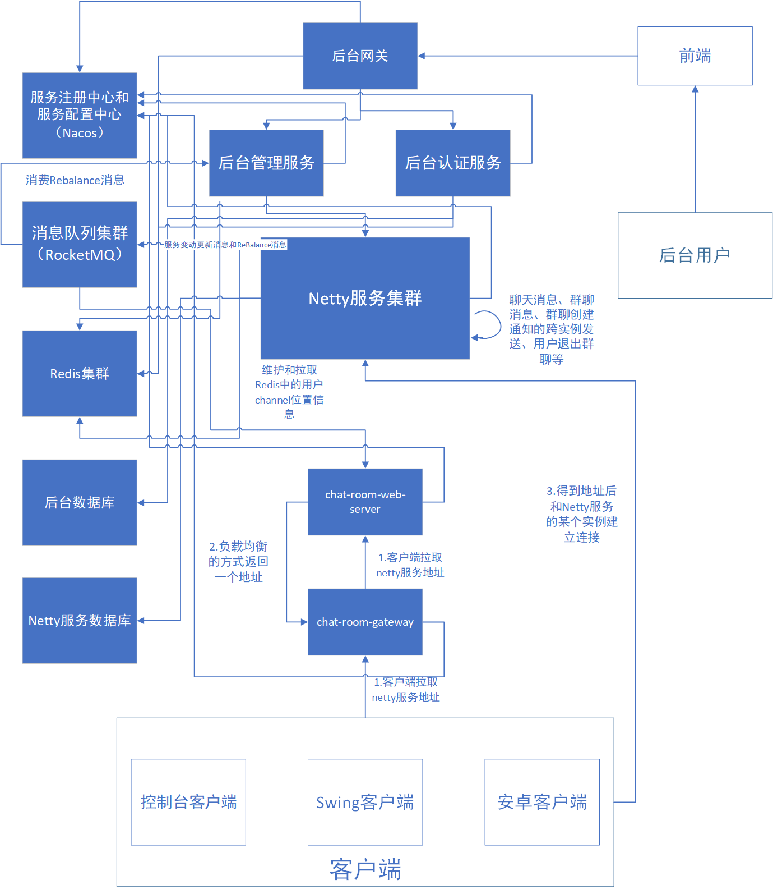

<h1 style="color:skyblue;text-align:center">基于SpringCloud+Netty实现的在线网络聊天室</h1>


# 项目地址

https://github.com/maomao124/netty_chat_room


# 简介

基于SpringCloud+Netty实现的在线网络聊天室。netty服务是集群部署的，netty共享channel解决方案。

用户方面，有用户登录、用户注册、发送消息、发送群聊消息、创建群聊、加入群聊、查看群聊成员、退出群聊等功能；

后台方面，有登录次数统计、登录UV统计、注册统计、消息发送统计、群聊消息发送统计、群聊创建统计、Netty服务ReBalance、用户管理、后台用户、资源、角色、菜单、组织、岗位管理、后台用户认证和鉴权等功能。


# 后端模块架构


```sh
authority                    #聚合工程，用于聚合parent、apps、tools等模块
├── parent				     # 父工程，nacos配置及依赖包管理
├── apps					 # 应用目录
	├── auth				 # 权限服务父工程
		├── auth-entity      # 权限实体
		├── auth-server      # 权限服务
	├── gateway			     # 后台网关服务
	├──chat-room             # 在线聊天室应用
	    ├──chat-room-client-api        # 客户端api模块，放不同类型、不同平台客户端的公共代码的模块
	    ├──chat-room-common            # 在线聊天室公共模块，放客户端和服务端公共代码的模块
	    ├──chat-room-console-client    # 在线聊天室控制台客户端
	    ├──chat-room-console-test-client   # 在线聊天室控制台压力测试客户端(不提供给用户使用)
	    ├──chat-room-gateway           # 在线聊天室用户http服务网关
	    ├──chat-room-manage            # 聊天室后台管理服务和统计服务
	    ├──chat-room-netty-server      # 在线聊天室netty服务
	    ├──chat-room-server-api        # 服务端api模块，放不同类型、不同平台服务端的公共代码的模块
	    ├──chat-room-swing-client      # 在线聊天室java SWing客户端
	    ├──chat-room-web-server        # 在线聊天室web服务 ，向用户提供http服务
└── tools				     # 工具工程
	├── tools-common		 # 基础组件：基础配置类、函数、常量、统一异常处理、undertow服务器
	├── tools-core		     # 核心组件：基础实体、返回对象、上下文、异常处理、分布式锁、函数、树
	├── tools-databases	     # 数据源组件：数据源配置、数据权限、查询条件等
	├── tools-dozer		     # 对象转换：dozer配置、工具
	├── tools-redis-cache    # redis分布式缓存工具类和分布式锁服务，缓存工具类解决著名的3个缓存问题
	├── tools-j2cache	     # 缓存组件：j2cache、redis缓存
	├── tools-jwt            # JWT组件：配置、属性、工具
	├── tools-log	         # 日志组件：日志实体、事件、拦截器、工具
	├── tools-swagger2	     # 文档组件：knife4j文档
	├── tools-user           # 用户上下文：用户注解、模型和工具，当前登录用户信息注入模块
	├── tools-validator	     # 表单验证： 后台表单规则验证
	├── tools-xss		     # xss防注入组件
```


# 架构设计




# 技术

* **注册中心和配置中心：Nacos**
* **消息队列：RocketMQ**
* **关系数据库：MYSQL**
* **缓存服务：Redis**
* **二级缓存：j2cache**
* **负载均衡远程调用：Feign**
* **定向调用：RestTemplate**
* **网络框架：Netty**
* **对象转换：Dozer**
* **分布式锁：redisson**
* **防XSS攻击：antisamy**
* **接口文档：knife4j swagger**
* **令牌生成和解析：jjwt**
* **网关：zuul**
* **验证码生成：captcha**
* **......**


